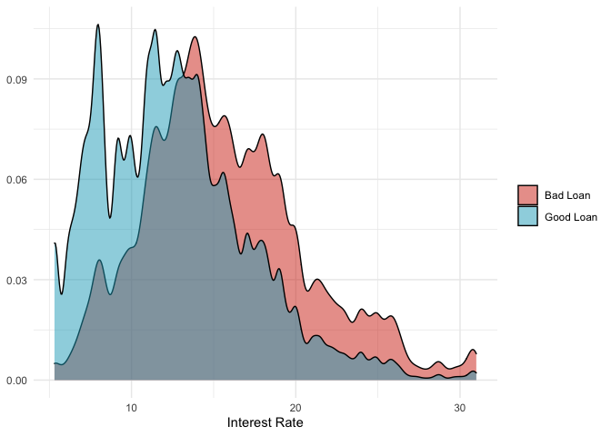

Lending Club Loan Data Analysis
================
Jared Lee
5/31/2020

## Summary

In a football game, the coach must decide on what play to run on
offense. The options for these play calls can be broken down into either
a pass, a run, or a kick – which can be either a field goal attempt or a
punt. Many factors influence the decision: field position, down and
distance, time left on the clock, and the score. The purpose of this
analysis is to develop a model that will predict what type of play a
coach will call in a given situation. To accomplish this, I looked at
information on the University of Utah’s football team from the 2019
season with head coach Kyle Whittingham.

## Preparations

This first chunk loads the necessary R packages.

``` r
library(tidymodels)
library(tidyverse)
```

## Analysis

### Data

Retrieved May 31, 2020 from
[Kaggle](https://www.kaggle.com/wendykan/lending-club-loan-data). These
files contain complete loan data for all loans issued through the
2007-2015, including the current loan status (Current, Late, Fully Paid,
etc.) and latest payment information. The file containing loan data
through the “present” contains complete loan data for all loans issued
through the previous completed calendar quarter.

``` r
# Read the file
loans <- read_csv("loan.csv")
```

    ## Parsed with column specification:
    ## cols(
    ##   .default = col_double(),
    ##   id = col_logical(),
    ##   member_id = col_logical(),
    ##   term = col_character(),
    ##   grade = col_character(),
    ##   sub_grade = col_character(),
    ##   emp_title = col_character(),
    ##   emp_length = col_character(),
    ##   home_ownership = col_character(),
    ##   verification_status = col_character(),
    ##   issue_d = col_character(),
    ##   loan_status = col_character(),
    ##   pymnt_plan = col_character(),
    ##   url = col_logical(),
    ##   desc = col_logical(),
    ##   purpose = col_character(),
    ##   title = col_character(),
    ##   zip_code = col_character(),
    ##   addr_state = col_character(),
    ##   earliest_cr_line = col_character(),
    ##   initial_list_status = col_character()
    ##   # ... with 29 more columns
    ## )

    ## See spec(...) for full column specifications.

    ## Warning: 462349 parsing failures.
    ##   row                       col           expected   actual       file
    ## 92797 debt_settlement_flag_date 1/0/T/F/TRUE/FALSE Feb-2019 'loan.csv'
    ## 92797 settlement_status         1/0/T/F/TRUE/FALSE ACTIVE   'loan.csv'
    ## 92797 settlement_date           1/0/T/F/TRUE/FALSE Feb-2019 'loan.csv'
    ## 92797 settlement_amount         1/0/T/F/TRUE/FALSE 5443     'loan.csv'
    ## 92797 settlement_percentage     1/0/T/F/TRUE/FALSE 65       'loan.csv'
    ## ..... ......................... .................. ........ ..........
    ## See problems(...) for more details.

``` r
# View Structure of Data
str(loans)
```

    ## tibble [2,260,668 × 145] (S3: spec_tbl_df/tbl_df/tbl/data.frame)
    ##  $ id                                        : logi [1:2260668] NA NA NA NA NA NA ...
    ##  $ member_id                                 : logi [1:2260668] NA NA NA NA NA NA ...
    ##  $ loan_amnt                                 : num [1:2260668] 2500 30000 5000 4000 30000 5550 2000 6000 5000 6000 ...
    ##  $ funded_amnt                               : num [1:2260668] 2500 30000 5000 4000 30000 5550 2000 6000 5000 6000 ...
    ##  $ funded_amnt_inv                           : num [1:2260668] 2500 30000 5000 4000 30000 5550 2000 6000 5000 6000 ...
    ##  $ term                                      : chr [1:2260668] "36 months" "60 months" "36 months" "36 months" ...
    ##  $ int_rate                                  : num [1:2260668] 13.6 18.9 18 18.9 16.1 ...
    ##  $ installment                               : num [1:2260668] 84.9 777.2 180.7 146.5 731.8 ...
    ##  $ grade                                     : chr [1:2260668] "C" "D" "D" "D" ...
    ##  $ sub_grade                                 : chr [1:2260668] "C1" "D2" "D1" "D2" ...
    ##  $ emp_title                                 : chr [1:2260668] "Chef" "Postmaster" "Administrative" "IT Supervisor" ...
    ##  $ emp_length                                : chr [1:2260668] "10+ years" "10+ years" "6 years" "10+ years" ...
    ##  $ home_ownership                            : chr [1:2260668] "RENT" "MORTGAGE" "MORTGAGE" "MORTGAGE" ...
    ##  $ annual_inc                                : num [1:2260668] 55000 90000 59280 92000 57250 ...
    ##  $ verification_status                       : chr [1:2260668] "Not Verified" "Source Verified" "Source Verified" "Source Verified" ...
    ##  $ issue_d                                   : chr [1:2260668] "Dec-2018" "Dec-2018" "Dec-2018" "Dec-2018" ...
    ##  $ loan_status                               : chr [1:2260668] "Current" "Current" "Current" "Current" ...
    ##  $ pymnt_plan                                : chr [1:2260668] "n" "n" "n" "n" ...
    ##  $ url                                       : logi [1:2260668] NA NA NA NA NA NA ...
    ##  $ desc                                      : logi [1:2260668] NA NA NA NA NA NA ...
    ##  $ purpose                                   : chr [1:2260668] "debt_consolidation" "debt_consolidation" "debt_consolidation" "debt_consolidation" ...
    ##  $ title                                     : chr [1:2260668] "Debt consolidation" "Debt consolidation" "Debt consolidation" "Debt consolidation" ...
    ##  $ zip_code                                  : chr [1:2260668] "109xx" "713xx" "490xx" "985xx" ...
    ##  $ addr_state                                : chr [1:2260668] "NY" "LA" "MI" "WA" ...
    ##  $ dti                                       : num [1:2260668] 18.2 26.5 10.5 16.7 26.4 ...
    ##  $ delinq_2yrs                               : num [1:2260668] 0 0 0 0 0 0 0 0 0 1 ...
    ##  $ earliest_cr_line                          : chr [1:2260668] "Apr-2001" "Jun-1987" "Apr-2011" "Feb-2006" ...
    ##  $ inq_last_6mths                            : num [1:2260668] 1 0 0 0 0 3 1 0 1 1 ...
    ##  $ mths_since_last_delinq                    : num [1:2260668] NA 71 NA NA NA NA NA NA 32 17 ...
    ##  $ mths_since_last_record                    : num [1:2260668] 45 75 NA NA NA NA NA NA NA NA ...
    ##  $ open_acc                                  : num [1:2260668] 9 13 8 10 12 18 1 19 8 38 ...
    ##  $ pub_rec                                   : num [1:2260668] 1 1 0 0 0 0 0 0 0 0 ...
    ##  $ revol_bal                                 : num [1:2260668] 4341 12315 4599 5468 829 ...
    ##  $ revol_util                                : num [1:2260668] 10.3 24.2 19.1 78.1 3.6 48.1 NA 69.3 35.2 49.8 ...
    ##  $ total_acc                                 : num [1:2260668] 34 44 13 13 26 44 9 37 38 58 ...
    ##  $ initial_list_status                       : chr [1:2260668] "w" "w" "w" "w" ...
    ##  $ out_prncp                                 : num [1:2260668] 2386 29388 4787 3832 29339 ...
    ##  $ out_prncp_inv                             : num [1:2260668] 2386 29388 4787 3832 29339 ...
    ##  $ total_pymnt                               : num [1:2260668] 167 1507 354 287 1423 ...
    ##  $ total_pymnt_inv                           : num [1:2260668] 167 1507 354 287 1423 ...
    ##  $ total_rec_prncp                           : num [1:2260668] 114 612 213 168 661 ...
    ##  $ total_rec_int                             : num [1:2260668] 53 895 141 119 762 ...
    ##  $ total_rec_late_fee                        : num [1:2260668] 0 0 0 0 0 0 0 0 0 0 ...
    ##  $ recoveries                                : num [1:2260668] 0 0 0 0 0 0 0 0 0 0 ...
    ##  $ collection_recovery_fee                   : num [1:2260668] 0 0 0 0 0 0 0 0 0 0 ...
    ##  $ last_pymnt_d                              : chr [1:2260668] "Feb-2019" "Feb-2019" "Feb-2019" "Feb-2019" ...
    ##  $ last_pymnt_amnt                           : num [1:2260668] 84.9 777.2 180.7 146.5 731.8 ...
    ##  $ next_pymnt_d                              : chr [1:2260668] "Mar-2019" "Mar-2019" "Mar-2019" "Mar-2019" ...
    ##  $ last_credit_pull_d                        : chr [1:2260668] "Feb-2019" "Feb-2019" "Feb-2019" "Feb-2019" ...
    ##  $ collections_12_mths_ex_med                : num [1:2260668] 0 0 0 0 0 0 0 0 0 0 ...
    ##  $ mths_since_last_major_derog               : num [1:2260668] NA NA NA NA NA NA NA NA 45 NA ...
    ##  $ policy_code                               : num [1:2260668] 1 1 1 1 1 1 1 1 1 1 ...
    ##  $ application_type                          : chr [1:2260668] "Individual" "Individual" "Individual" "Individual" ...
    ##  $ annual_inc_joint                          : num [1:2260668] NA NA NA NA NA NA NA NA NA NA ...
    ##  $ dti_joint                                 : num [1:2260668] NA NA NA NA NA NA NA NA NA NA ...
    ##  $ verification_status_joint                 : chr [1:2260668] NA NA NA NA ...
    ##  $ acc_now_delinq                            : num [1:2260668] 0 0 0 0 0 0 0 0 0 0 ...
    ##  $ tot_coll_amt                              : num [1:2260668] 0 1208 0 686 0 ...
    ##  $ tot_cur_bal                               : num [1:2260668] 16901 321915 110299 305049 116007 ...
    ##  $ open_acc_6m                               : num [1:2260668] 2 4 0 1 3 1 0 0 5 1 ...
    ##  $ open_act_il                               : num [1:2260668] 2 4 1 5 5 7 0 5 2 4 ...
    ##  $ open_il_12m                               : num [1:2260668] 1 2 0 3 3 2 2 0 5 1 ...
    ##  $ open_il_24m                               : num [1:2260668] 2 3 2 5 5 3 3 1 5 3 ...
    ##  $ mths_since_rcnt_il                        : num [1:2260668] 2 3 14 5 4 4 7 23 3 7 ...
    ##  $ total_bal_il                              : num [1:2260668] 12560 87153 7150 30683 28845 ...
    ##  $ il_util                                   : num [1:2260668] 69 88 72 68 89 72 NA 87 98 45 ...
    ##  $ open_rv_12m                               : num [1:2260668] 2 4 0 0 2 1 0 0 1 1 ...
    ##  $ open_rv_24m                               : num [1:2260668] 7 5 2 0 4 4 1 2 6 12 ...
    ##  $ max_bal_bc                                : num [1:2260668] 2137 998 0 3761 516 ...
    ##  $ all_util                                  : num [1:2260668] 28 57 35 70 54 58 100 74 73 48 ...
    ##  $ total_rev_hi_lim                          : num [1:2260668] 42000 50800 24100 7000 23100 ...
    ##  $ inq_fi                                    : num [1:2260668] 1 2 1 2 1 2 0 1 2 2 ...
    ##  $ total_cu_tl                               : num [1:2260668] 11 15 5 4 0 4 0 2 1 2 ...
    ##  $ inq_last_12m                              : num [1:2260668] 2 2 0 3 0 6 1 0 4 2 ...
    ##  $ acc_open_past_24mths                      : num [1:2260668] 9 10 4 5 9 8 4 3 12 15 ...
    ##  $ avg_cur_bal                               : num [1:2260668] 1878 24763 18383 30505 9667 ...
    ##  $ bc_open_to_buy                            : num [1:2260668] 34360 13761 13800 1239 8471 ...
    ##  $ bc_util                                   : num [1:2260668] 5.9 8.3 0 75.2 8.9 64 NA 90.8 35.9 60.6 ...
    ##  $ chargeoff_within_12_mths                  : num [1:2260668] 0 0 0 0 0 0 0 0 0 0 ...
    ##  $ delinq_amnt                               : num [1:2260668] 0 0 0 0 0 0 0 0 0 0 ...
    ##  $ mo_sin_old_il_acct                        : num [1:2260668] 140 163 87 62 53 195 169 169 145 166 ...
    ##  $ mo_sin_old_rev_tl_op                      : num [1:2260668] 212 378 92 154 216 176 40 253 244 200 ...
    ##  $ mo_sin_rcnt_rev_tl_op                     : num [1:2260668] 1 4 15 64 2 10 23 13 6 4 ...
    ##  $ mo_sin_rcnt_tl                            : num [1:2260668] 1 3 14 5 2 4 7 13 3 4 ...
    ##  $ mort_acc                                  : num [1:2260668] 0 3 2 3 2 6 0 1 3 1 ...
    ##  $ mths_since_recent_bc                      : num [1:2260668] 1 4 77 64 2 20 NA 14 6 4 ...
    ##  $ mths_since_recent_bc_dlq                  : num [1:2260668] NA NA NA NA NA NA NA NA 33 NA ...
    ##  $ mths_since_recent_inq                     : num [1:2260668] 2 4 14 5 13 3 1 13 2 4 ...
    ##  $ mths_since_recent_revol_delinq            : num [1:2260668] NA NA NA NA NA NA NA NA 32 17 ...
    ##  $ num_accts_ever_120_pd                     : num [1:2260668] 0 0 0 0 0 0 0 0 2 0 ...
    ##  $ num_actv_bc_tl                            : num [1:2260668] 2 2 0 1 2 4 0 7 4 16 ...
    ##  $ num_actv_rev_tl                           : num [1:2260668] 5 4 3 2 2 6 0 12 5 20 ...
    ##  $ num_bc_sats                               : num [1:2260668] 3 4 3 1 3 6 0 8 5 19 ...
    ##  $ num_bc_tl                                 : num [1:2260668] 3 9 3 2 8 10 3 10 10 26 ...
    ##  $ num_il_tl                                 : num [1:2260668] 16 27 4 7 9 23 5 15 20 9 ...
    ##  $ num_op_rev_tl                             : num [1:2260668] 7 8 6 2 6 9 0 14 6 33 ...
    ##  $ num_rev_accts                             : num [1:2260668] 18 14 7 3 15 15 3 20 15 48 ...
    ##  $ num_rev_tl_bal_gt_0                       : num [1:2260668] 5 4 3 2 2 7 0 12 5 20 ...
    ##  $ num_sats                                  : num [1:2260668] 9 13 8 10 12 18 1 19 8 38 ...
    ##   [list output truncated]
    ##  - attr(*, "problems")= tibble [462,349 × 5] (S3: tbl_df/tbl/data.frame)
    ##   ..$ row     : int [1:462349] 92797 92797 92797 92797 92797 92797 95386 95386 95386 95386 ...
    ##   ..$ col     : chr [1:462349] "debt_settlement_flag_date" "settlement_status" "settlement_date" "settlement_amount" ...
    ##   ..$ expected: chr [1:462349] "1/0/T/F/TRUE/FALSE" "1/0/T/F/TRUE/FALSE" "1/0/T/F/TRUE/FALSE" "1/0/T/F/TRUE/FALSE" ...
    ##   ..$ actual  : chr [1:462349] "Feb-2019" "ACTIVE" "Feb-2019" "5443" ...
    ##   ..$ file    : chr [1:462349] "'loan.csv'" "'loan.csv'" "'loan.csv'" "'loan.csv'" ...
    ##  - attr(*, "spec")=
    ##   .. cols(
    ##   ..   id = col_logical(),
    ##   ..   member_id = col_logical(),
    ##   ..   loan_amnt = col_double(),
    ##   ..   funded_amnt = col_double(),
    ##   ..   funded_amnt_inv = col_double(),
    ##   ..   term = col_character(),
    ##   ..   int_rate = col_double(),
    ##   ..   installment = col_double(),
    ##   ..   grade = col_character(),
    ##   ..   sub_grade = col_character(),
    ##   ..   emp_title = col_character(),
    ##   ..   emp_length = col_character(),
    ##   ..   home_ownership = col_character(),
    ##   ..   annual_inc = col_double(),
    ##   ..   verification_status = col_character(),
    ##   ..   issue_d = col_character(),
    ##   ..   loan_status = col_character(),
    ##   ..   pymnt_plan = col_character(),
    ##   ..   url = col_logical(),
    ##   ..   desc = col_logical(),
    ##   ..   purpose = col_character(),
    ##   ..   title = col_character(),
    ##   ..   zip_code = col_character(),
    ##   ..   addr_state = col_character(),
    ##   ..   dti = col_double(),
    ##   ..   delinq_2yrs = col_double(),
    ##   ..   earliest_cr_line = col_character(),
    ##   ..   inq_last_6mths = col_double(),
    ##   ..   mths_since_last_delinq = col_double(),
    ##   ..   mths_since_last_record = col_double(),
    ##   ..   open_acc = col_double(),
    ##   ..   pub_rec = col_double(),
    ##   ..   revol_bal = col_double(),
    ##   ..   revol_util = col_double(),
    ##   ..   total_acc = col_double(),
    ##   ..   initial_list_status = col_character(),
    ##   ..   out_prncp = col_double(),
    ##   ..   out_prncp_inv = col_double(),
    ##   ..   total_pymnt = col_double(),
    ##   ..   total_pymnt_inv = col_double(),
    ##   ..   total_rec_prncp = col_double(),
    ##   ..   total_rec_int = col_double(),
    ##   ..   total_rec_late_fee = col_double(),
    ##   ..   recoveries = col_double(),
    ##   ..   collection_recovery_fee = col_double(),
    ##   ..   last_pymnt_d = col_character(),
    ##   ..   last_pymnt_amnt = col_double(),
    ##   ..   next_pymnt_d = col_character(),
    ##   ..   last_credit_pull_d = col_character(),
    ##   ..   collections_12_mths_ex_med = col_double(),
    ##   ..   mths_since_last_major_derog = col_double(),
    ##   ..   policy_code = col_double(),
    ##   ..   application_type = col_character(),
    ##   ..   annual_inc_joint = col_double(),
    ##   ..   dti_joint = col_double(),
    ##   ..   verification_status_joint = col_character(),
    ##   ..   acc_now_delinq = col_double(),
    ##   ..   tot_coll_amt = col_double(),
    ##   ..   tot_cur_bal = col_double(),
    ##   ..   open_acc_6m = col_double(),
    ##   ..   open_act_il = col_double(),
    ##   ..   open_il_12m = col_double(),
    ##   ..   open_il_24m = col_double(),
    ##   ..   mths_since_rcnt_il = col_double(),
    ##   ..   total_bal_il = col_double(),
    ##   ..   il_util = col_double(),
    ##   ..   open_rv_12m = col_double(),
    ##   ..   open_rv_24m = col_double(),
    ##   ..   max_bal_bc = col_double(),
    ##   ..   all_util = col_double(),
    ##   ..   total_rev_hi_lim = col_double(),
    ##   ..   inq_fi = col_double(),
    ##   ..   total_cu_tl = col_double(),
    ##   ..   inq_last_12m = col_double(),
    ##   ..   acc_open_past_24mths = col_double(),
    ##   ..   avg_cur_bal = col_double(),
    ##   ..   bc_open_to_buy = col_double(),
    ##   ..   bc_util = col_double(),
    ##   ..   chargeoff_within_12_mths = col_double(),
    ##   ..   delinq_amnt = col_double(),
    ##   ..   mo_sin_old_il_acct = col_double(),
    ##   ..   mo_sin_old_rev_tl_op = col_double(),
    ##   ..   mo_sin_rcnt_rev_tl_op = col_double(),
    ##   ..   mo_sin_rcnt_tl = col_double(),
    ##   ..   mort_acc = col_double(),
    ##   ..   mths_since_recent_bc = col_double(),
    ##   ..   mths_since_recent_bc_dlq = col_double(),
    ##   ..   mths_since_recent_inq = col_double(),
    ##   ..   mths_since_recent_revol_delinq = col_double(),
    ##   ..   num_accts_ever_120_pd = col_double(),
    ##   ..   num_actv_bc_tl = col_double(),
    ##   ..   num_actv_rev_tl = col_double(),
    ##   ..   num_bc_sats = col_double(),
    ##   ..   num_bc_tl = col_double(),
    ##   ..   num_il_tl = col_double(),
    ##   ..   num_op_rev_tl = col_double(),
    ##   ..   num_rev_accts = col_double(),
    ##   ..   num_rev_tl_bal_gt_0 = col_double(),
    ##   ..   num_sats = col_double(),
    ##   ..   num_tl_120dpd_2m = col_double(),
    ##   ..   num_tl_30dpd = col_double(),
    ##   ..   num_tl_90g_dpd_24m = col_double(),
    ##   ..   num_tl_op_past_12m = col_double(),
    ##   ..   pct_tl_nvr_dlq = col_double(),
    ##   ..   percent_bc_gt_75 = col_double(),
    ##   ..   pub_rec_bankruptcies = col_double(),
    ##   ..   tax_liens = col_double(),
    ##   ..   tot_hi_cred_lim = col_double(),
    ##   ..   total_bal_ex_mort = col_double(),
    ##   ..   total_bc_limit = col_double(),
    ##   ..   total_il_high_credit_limit = col_double(),
    ##   ..   revol_bal_joint = col_double(),
    ##   ..   sec_app_earliest_cr_line = col_character(),
    ##   ..   sec_app_inq_last_6mths = col_double(),
    ##   ..   sec_app_mort_acc = col_double(),
    ##   ..   sec_app_open_acc = col_double(),
    ##   ..   sec_app_revol_util = col_double(),
    ##   ..   sec_app_open_act_il = col_double(),
    ##   ..   sec_app_num_rev_accts = col_double(),
    ##   ..   sec_app_chargeoff_within_12_mths = col_double(),
    ##   ..   sec_app_collections_12_mths_ex_med = col_double(),
    ##   ..   sec_app_mths_since_last_major_derog = col_double(),
    ##   ..   hardship_flag = col_character(),
    ##   ..   hardship_type = col_logical(),
    ##   ..   hardship_reason = col_logical(),
    ##   ..   hardship_status = col_logical(),
    ##   ..   deferral_term = col_logical(),
    ##   ..   hardship_amount = col_logical(),
    ##   ..   hardship_start_date = col_logical(),
    ##   ..   hardship_end_date = col_logical(),
    ##   ..   payment_plan_start_date = col_logical(),
    ##   ..   hardship_length = col_logical(),
    ##   ..   hardship_dpd = col_logical(),
    ##   ..   hardship_loan_status = col_logical(),
    ##   ..   orig_projected_additional_accrued_interest = col_logical(),
    ##   ..   hardship_payoff_balance_amount = col_logical(),
    ##   ..   hardship_last_payment_amount = col_logical(),
    ##   ..   disbursement_method = col_character(),
    ##   ..   debt_settlement_flag = col_character(),
    ##   ..   debt_settlement_flag_date = col_logical(),
    ##   ..   settlement_status = col_logical(),
    ##   ..   settlement_date = col_logical(),
    ##   ..   settlement_amount = col_logical(),
    ##   ..   settlement_percentage = col_logical(),
    ##   ..   settlement_term = col_logical()
    ##   .. )

``` r
head(loans)
```

    ## Warning: `...` is not empty.
    ## 
    ## We detected these problematic arguments:
    ## * `needs_dots`
    ## 
    ## These dots only exist to allow future extensions and should be empty.
    ## Did you misspecify an argument?

    ## # A tibble: 6 x 145
    ##   id    member_id loan_amnt funded_amnt funded_amnt_inv term  int_rate
    ##   <lgl> <lgl>         <dbl>       <dbl>           <dbl> <chr>    <dbl>
    ## 1 NA    NA             2500        2500            2500 36 m…     13.6
    ## 2 NA    NA            30000       30000           30000 60 m…     18.9
    ## 3 NA    NA             5000        5000            5000 36 m…     18.0
    ## 4 NA    NA             4000        4000            4000 36 m…     18.9
    ## 5 NA    NA            30000       30000           30000 60 m…     16.1
    ## 6 NA    NA             5550        5550            5550 36 m…     15.0
    ## # … with 138 more variables: installment <dbl>, grade <chr>, sub_grade <chr>,
    ## #   emp_title <chr>, emp_length <chr>, home_ownership <chr>, annual_inc <dbl>,
    ## #   verification_status <chr>, issue_d <chr>, loan_status <chr>,
    ## #   pymnt_plan <chr>, url <lgl>, desc <lgl>, purpose <chr>, title <chr>,
    ## #   zip_code <chr>, addr_state <chr>, dti <dbl>, delinq_2yrs <dbl>,
    ## #   earliest_cr_line <chr>, inq_last_6mths <dbl>, mths_since_last_delinq <dbl>,
    ## #   mths_since_last_record <dbl>, open_acc <dbl>, pub_rec <dbl>,
    ## #   revol_bal <dbl>, revol_util <dbl>, total_acc <dbl>,
    ## #   initial_list_status <chr>, out_prncp <dbl>, out_prncp_inv <dbl>,
    ## #   total_pymnt <dbl>, total_pymnt_inv <dbl>, total_rec_prncp <dbl>,
    ## #   total_rec_int <dbl>, total_rec_late_fee <dbl>, recoveries <dbl>,
    ## #   collection_recovery_fee <dbl>, last_pymnt_d <chr>, last_pymnt_amnt <dbl>,
    ## #   next_pymnt_d <chr>, last_credit_pull_d <chr>,
    ## #   collections_12_mths_ex_med <dbl>, mths_since_last_major_derog <dbl>,
    ## #   policy_code <dbl>, application_type <chr>, annual_inc_joint <dbl>,
    ## #   dti_joint <dbl>, verification_status_joint <chr>, acc_now_delinq <dbl>,
    ## #   tot_coll_amt <dbl>, tot_cur_bal <dbl>, open_acc_6m <dbl>,
    ## #   open_act_il <dbl>, open_il_12m <dbl>, open_il_24m <dbl>,
    ## #   mths_since_rcnt_il <dbl>, total_bal_il <dbl>, il_util <dbl>,
    ## #   open_rv_12m <dbl>, open_rv_24m <dbl>, max_bal_bc <dbl>, all_util <dbl>,
    ## #   total_rev_hi_lim <dbl>, inq_fi <dbl>, total_cu_tl <dbl>,
    ## #   inq_last_12m <dbl>, acc_open_past_24mths <dbl>, avg_cur_bal <dbl>,
    ## #   bc_open_to_buy <dbl>, bc_util <dbl>, chargeoff_within_12_mths <dbl>,
    ## #   delinq_amnt <dbl>, mo_sin_old_il_acct <dbl>, mo_sin_old_rev_tl_op <dbl>,
    ## #   mo_sin_rcnt_rev_tl_op <dbl>, mo_sin_rcnt_tl <dbl>, mort_acc <dbl>,
    ## #   mths_since_recent_bc <dbl>, mths_since_recent_bc_dlq <dbl>,
    ## #   mths_since_recent_inq <dbl>, mths_since_recent_revol_delinq <dbl>,
    ## #   num_accts_ever_120_pd <dbl>, num_actv_bc_tl <dbl>, num_actv_rev_tl <dbl>,
    ## #   num_bc_sats <dbl>, num_bc_tl <dbl>, num_il_tl <dbl>, num_op_rev_tl <dbl>,
    ## #   num_rev_accts <dbl>, num_rev_tl_bal_gt_0 <dbl>, num_sats <dbl>,
    ## #   num_tl_120dpd_2m <dbl>, num_tl_30dpd <dbl>, num_tl_90g_dpd_24m <dbl>,
    ## #   num_tl_op_past_12m <dbl>, pct_tl_nvr_dlq <dbl>, percent_bc_gt_75 <dbl>,
    ## #   pub_rec_bankruptcies <dbl>, tax_liens <dbl>, …

``` r
# Summary of some key character columns
summary(as.factor(loans$term))
```

    ## 36 months 60 months 
    ##   1609754    650914

``` r
summary(as.factor(loans$grade))
```

    ##      A      B      C      D      E      F      G 
    ## 433027 663557 650053 324424 135639  41800  12168

``` r
summary(as.factor(loans$sub_grade))
```

    ##     A1     A2     A3     A4     A5     B1     B2     B3     B4     B5     C1 
    ##  86790  69562  73184  95874 107617 125341 126621 131514 139793 140288 145903 
    ##     C2     C3     C4     C5     D1     D2     D3     D4     D5     E1     E2 
    ## 131116 129193 127115 116726  81787  72899  64819  56896  48023  33573  29924 
    ##     E3     E4     E5     F1     F2     F3     F4     F5     G1     G2     G3 
    ##  26708  22763  22671  13413   9305   7791   6124   5167   4106   2688   2094 
    ##     G4     G5 
    ##   1712   1568

``` r
summary(as.factor(loans$emp_length))
```

    ##  < 1 year    1 year 10+ years   2 years   3 years   4 years   5 years   6 years 
    ##    189988    148403    748005    203677    180753    136605    139698    102628 
    ##   7 years   8 years   9 years       n/a 
    ##     92695     91914     79395    146907

``` r
summary(as.factor(loans$home_ownership))
```

    ##      ANY MORTGAGE     NONE    OTHER      OWN     RENT 
    ##      996  1111450       54      182   253057   894929

``` r
summary(as.factor(loans$purpose))
```

    ##                car        credit_card debt_consolidation        educational 
    ##              24013             516971            1277877                424 
    ##   home_improvement              house     major_purchase            medical 
    ##             150457              14136              50445              27488 
    ##             moving              other   renewable_energy     small_business 
    ##              15403             139440               1445              24689 
    ##           vacation            wedding 
    ##              15525               2355

``` r
# Loan status is the most important column
summary(as.factor(loans$loan_status))
```

    ##                                         Charged Off 
    ##                                              261655 
    ##                                             Current 
    ##                                              919695 
    ##                                             Default 
    ##                                                  31 
    ## Does not meet the credit policy. Status:Charged Off 
    ##                                                 761 
    ##  Does not meet the credit policy. Status:Fully Paid 
    ##                                                1988 
    ##                                          Fully Paid 
    ##                                             1041952 
    ##                                     In Grace Period 
    ##                                                8952 
    ##                                   Late (16-30 days) 
    ##                                                3737 
    ##                                  Late (31-120 days) 
    ##                                               21897

### Preprocessing

ASDF

``` r
# To simplify, loan status will be grouped into 3 categories: Current, Good, Bad
good_loans <- c("Does not meet the credit policy. Status:Fully Paid","Fully Paid")
bad_loans <- c("Charged Off","Does not meet the credit policy. Status:Charged Off","Default","Late (31-120 days)")
current_loans <- c("Current","In Grace Period","Late (16-30 days)")

loans <- loans %>%
  mutate(outcome = case_when(loan_status %in% good_loans ~ "Good Loan",
                             loan_status %in% bad_loans ~ "Bad Loan",
                             loan_status %in% current_loans ~ "Current",
                             TRUE ~ "Other"))
# Make Sure that all loan_status are converted (no "Other"s)
summary(as.factor(loans$outcome))
```

    ##  Bad Loan   Current Good Loan 
    ##    284344    932384   1043940

``` r
# Filter out current loans
finished_loans <- loans %>%
  filter(outcome != "Current")
```

### Exploratory Analysis

ASDF

``` r
plotData <- function(data,group,label = group) {
  colors <- c("#D33016","#1BA9C2") #Bad,Good
  if(is.numeric(data[[group]])) {
    data %>%
      ggplot(aes(x = .data[[group[[1]]]],fill = outcome)) +
      geom_density(alpha = 0.5) +
      scale_fill_manual(values = colors) +
      labs(x = label,y = NULL,fill = NULL) +
      theme_minimal()
  } else {
    data %>%
      group_by(.data[[group[[1]]]],outcome) %>%
      summarize(Count = n()) %>%
      mutate(Proportion = Count/sum(Count)) %>%
      pivot_longer(Count:Proportion) %>%
      ggplot(aes(x = .data[[group[[1]]]],y = value,fill = outcome))+
      geom_col()+
      labs(x = label,y = NULL,fill = NULL) +
      scale_fill_manual(values = colors) + 
      facet_wrap(~name,scales = "free_x") +
      coord_flip() +
      theme_minimal()
  }
}
```

``` r
plotData(finished_loans,"int_rate",label = "Interest Rate")
```

<!-- -->

ASDF

#### Key Takeaways

  - Point 1

  - Point 2

ASDF

#### Key Takeaways

  - Point 1

  - Point 2

ASDF

#### Key Takeaways

  - POint 1

ASDF

#### Key Takeaways

  - Point 1

## Modeling

### Model Preperation

ASDF

## Model Comparison

ASDf

### Model Metrics

ASDF

ASDF

## Conclusion

### Future Work
