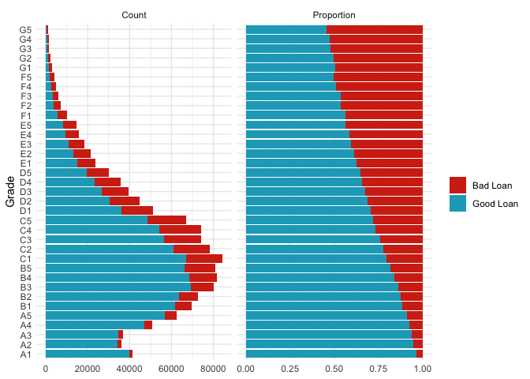
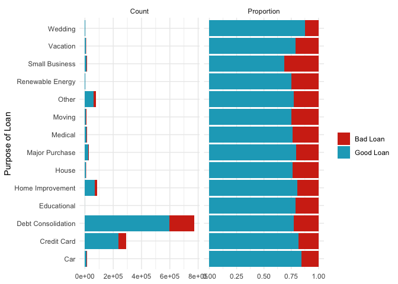

Lending Club Loan Data Analysis
================
Jared Lee

  - [Summary](#summary)
  - [Preparations](#preparations)
  - [Analysis](#analysis)
      - [Data](#data)
      - [Preprocessing](#preprocessing)
      - [Exploratory Analysis](#exploratory-analysis)
  - [Modeling](#modeling)
      - [Model Preperation](#model-preperation)
  - [Unsupervised Machine Learning:
    Clustering](#unsupervised-machine-learning-clustering)
  - [Supervised Machine Learning: Predicting Loan
    Quality](#supervised-machine-learning-predicting-loan-quality)
      - [Model Metrics](#model-metrics)
  - [Conclusion](#conclusion)
      - [Future Work](#future-work)

## Summary

[Lending Club](https://www.lendingclub.com/) is a peer-to-peer lending
company. The purpose of this analysis is to look at loan data from
Lending Club to see what factors influence the likelihood of a loan
being paid in full. Additionally, this analysis will be used to develop
a model to predict the probability of a given current loan defaulting or
being charged off.

## Preparations

This first chunk loads the necessary R packages.

``` r
library(tidymodels)
library(tidyverse)
```

## Analysis

### Data

The Lending Club data was retrieved May 31, 2020 from
[Kaggle](https://www.kaggle.com/wendykan/lending-club-loan-data). These
files contain complete loan data for all loans issued through the
2007-2015, including the current loan status (Current, Late, Fully Paid,
etc.) and latest payment information. The file containing loan data
through the “present” contains complete loan data for all loans issued
through the previous completed calendar quarter. Additionally,
population data was collected from the [U. S.
Census](https://www.census.gov/data/tables/time-series/demo/popest/2010s-state-total.html)
to calculate per capita values.

``` r
# Read the files
loans <- read_csv("loan.csv")
popDF <- read_csv("nst-est2019-alldata.csv")

# View Structure of Data
str(loans)
head(loans)
```

``` r
# Summary of some key character columns
summary(as.factor(loans$term))
```

    ## 36 months 60 months 
    ##   1609754    650914

``` r
summary(as.factor(loans$grade))
```

    ##      A      B      C      D      E      F      G 
    ## 433027 663557 650053 324424 135639  41800  12168

``` r
summary(as.factor(loans$sub_grade))
```

    ##     A1     A2     A3     A4     A5     B1     B2     B3     B4     B5     C1 
    ##  86790  69562  73184  95874 107617 125341 126621 131514 139793 140288 145903 
    ##     C2     C3     C4     C5     D1     D2     D3     D4     D5     E1     E2 
    ## 131116 129193 127115 116726  81787  72899  64819  56896  48023  33573  29924 
    ##     E3     E4     E5     F1     F2     F3     F4     F5     G1     G2     G3 
    ##  26708  22763  22671  13413   9305   7791   6124   5167   4106   2688   2094 
    ##     G4     G5 
    ##   1712   1568

``` r
summary(as.factor(loans$emp_length))
```

    ##  < 1 year    1 year 10+ years   2 years   3 years   4 years   5 years   6 years 
    ##    189988    148403    748005    203677    180753    136605    139698    102628 
    ##   7 years   8 years   9 years       n/a 
    ##     92695     91914     79395    146907

``` r
summary(as.factor(loans$home_ownership))
```

    ##      ANY MORTGAGE     NONE    OTHER      OWN     RENT 
    ##      996  1111450       54      182   253057   894929

``` r
summary(as.factor(loans$purpose))
```

    ##                car        credit_card debt_consolidation        educational 
    ##              24013             516971            1277877                424 
    ##   home_improvement              house     major_purchase            medical 
    ##             150457              14136              50445              27488 
    ##             moving              other   renewable_energy     small_business 
    ##              15403             139440               1445              24689 
    ##           vacation            wedding 
    ##              15525               2355

``` r
# Loan status is the most important column
summary(as.factor(loans$loan_status))
```

    ##                                         Charged Off 
    ##                                              261655 
    ##                                             Current 
    ##                                              919695 
    ##                                             Default 
    ##                                                  31 
    ## Does not meet the credit policy. Status:Charged Off 
    ##                                                 761 
    ##  Does not meet the credit policy. Status:Fully Paid 
    ##                                                1988 
    ##                                          Fully Paid 
    ##                                             1041952 
    ##                                     In Grace Period 
    ##                                                8952 
    ##                                   Late (16-30 days) 
    ##                                                3737 
    ##                                  Late (31-120 days) 
    ##                                               21897

### Preprocessing

The data appears pretty clean and the summarized variables do not need
to be cleaned further. The sub\_grade column appears to be a more
granular view of the grade column and so only one of them should be used
in any modeling. The loan\_status column does need to be cleaned up,
though, and will be split into three groups: Good Loans, Bad Loans, and
Current Loans. Good loans will be the loans that have been fully paid.
Bad loans will be loans that were charged off, defaulted or more than a
month late on the latest payment. Current Loans will be loans that are
currently outstanding, in the grace period, or less than a month late on
the latest payment. For the purpose of this analysis, current loans will
be ignored.

``` r
# To simplify, loan status will be grouped into 3 categories: Current, Good, Bad
good_loans <- c("Does not meet the credit policy. Status:Fully Paid","Fully Paid")
bad_loans <- c("Charged Off","Does not meet the credit policy. Status:Charged Off","Default","Late (31-120 days)")
current_loans <- c("Current","In Grace Period","Late (16-30 days)")

# Create a new outcome column based on loan_status
loans <- loans %>%
  mutate(outcome = case_when(loan_status %in% good_loans ~ "Good Loan",
                             loan_status %in% bad_loans ~ "Bad Loan",
                             loan_status %in% current_loans ~ "Current",
                             TRUE ~ "Other"))

# Make Sure that all loan_status are converted (no "Other"s)
summary(as.factor(loans$outcome))
```

    ##  Bad Loan   Current Good Loan 
    ##    284344    932384   1043940

``` r
# Filter out current loans
finished_loans <- loans %>%
  filter(outcome != "Current")
```

### Exploratory Analysis

Several plots will be created to explore how different variables affect
the quality of a loan. To minimize the amount of code and keep a
consistent style, this function generates plots based on a column input.
It creates a density plot for numeric columns and two bar plots for
catagorical columns, one with the count and one with the proportion of
the quality of the loan. It is important to remember density plots do
not show the actual counts. Because there are significantly more good
loans in the data set, the density plots can make it appear like there
are more bad loans than in reality. A bad loan peak that is higher than
a good loan peak does not mean that there are more bad loans at that
value.

``` r
plotData <- function(data, group, label = group) {
  colors <- c("#D33016","#1BA9C2") #Bad,Good
  if(is.numeric(data[[group]])) {
    data %>%
      ggplot(aes(x = .data[[group[[1]]]],fill = outcome)) +
      geom_density(alpha = 0.5) +
      scale_fill_manual(values = colors) +
      labs(x = label,y = NULL,fill = NULL) +
      theme_minimal()
  } else {
    data %>%
      group_by(.data[[group[[1]]]],outcome) %>%
      summarize(Count = n()) %>%
      mutate(Proportion = Count/sum(Count)) %>%
      pivot_longer(Count:Proportion) %>%
      ggplot(aes(x = .data[[group[[1]]]],y = value,fill = outcome))+
      geom_col()+
      labs(x = label,y = NULL,fill = NULL) +
      scale_fill_manual(values = colors) + 
      facet_wrap(~name,scales = "free_x") +
      coord_flip() +
      theme_minimal()
  }
}
```

``` r
plotData(finished_loans,"int_rate",label = "Interest Rate")
```

<!-- -->

This density plot of the interest rate clearly shows that most of the
loans have an interest rate of 20% or less. There is also a split
between the quality of the loans: Good loans tend to have lower interest
rates than bad loans. Most of the good loans have interest rates less
than 15% with the most common interest rate being slightly above 5% and
about 12%. Bad loans have interest rates that are typically between 10%
and 20% with a most common rate of about 14%. Loans with interest rates
higher than 20% are rare and more likely to be bad loans.

#### Key Takeaways

  - Good loans tend to have lower interest rates than bad loans.

  - Interest rates are typically less than 15% for good loans and
    between 10% and 20% for bad loans.

<!-- end list -->

``` r
plotData(finished_loans,"loan_amnt",label = "Loan Amount")
```

<!-- -->

This is a similar density plot of the quality of loans by the size of
the loan. There are clear peaks at round numbers, which is unsurprising
as a loan of $15,000 is much more likely to occur than a loan of
$12,345. The most common loan is for $10,000, and amounts less than that
are slightly more likely to be a good loan. Loans greater than $10,000
may be more likely to be a bad loan but the ratio of good loans to bad
loans does not appear to change significantly above that amount.

#### Key Takeaways

  - The most common loan is for $10,000.

  - The ratio of good loans to bad loans is similar for loans more than
    %12,000.

<!-- end list -->

``` r
plotData(finished_loans,"installment",label = "Monthly Payment [$]")
```

<!-- -->

This density plot shows the distributions of good and bad loans against
the size of the monthly payments on the loans. Both distributions look
very similar to each other with most payments under $500. The most
common payment for either quality loans was around $300.

#### Key Takeaways

  - Most payments are under $500.

  - The quality of the loan does not appear to relate to the size of the
    monthly installment.

<!-- end list -->

``` r
plotData(finished_loans,"term",label = "Loan Length")
```

<!-- -->

The term length for Lending Club loans is either 3 or 5 years. The vast
majority of loans are for 3 years and that is the length suggest by
Lending Club. When a loan has a term length of 5 years, it is a bad loan
approximately 35% of the time. This is much higher than the
approximately 11% of 3 year loans that are bad.

#### Key Takeaways

  - The majority of Lending Club loans are for 36 months or 3 years.

  - 60 month or 5 year loans have a higher proportion of bad loans.

<!-- -->

The grade of the loan is calculated by Lending Club based on several
factors, the largest of which is the applicants credit score. The
Lending Club data does not include the applicants credit score so the
grade will be used as a proxy. The grade of most of the loans are B or C
and the distribution is slightly skewed toward lower grades.There is a
very clear and strong relationship between the grade and the quality of
a loan. Loans with higher grades are more likely to be good loans, and
loans with lower grades are more likely to be bad loans. However, There
are a low number of F and G loans and so the expected proportion of the
quality of the loans may have more uncertainty. Even ignoring F and G
loans, the relationship between grade and quality of loans is still very
clear and strong.

#### Key Takeaways

  - Grade is a proxy for the applicant’s credit score.

  - The grade distribution is skewed toward lower scores with the most
    loans occurring at grades of B or C.

  - Loans with higher grades are more likely to be good loans.

<!-- end list -->

``` r
finished_loans %>%
  mutate(emp_length = fct_relevel(emp_length,"10+ years",after = 10)) %>%
  mutate(emp_length = fct_relevel(emp_length,"n/a")) %>%
  plotData("emp_length",label = "Years Employed")
```

<!-- -->

The plurality of completed loans are given to people who have been
employed for 10 or more years. As the length of time employed increased
there is a very slight increase to the quality of the loans. When
employment length data is not available, the quality of the loan is much
lower.

#### Key Takeaways

  - Most loan recipients have been employed for 10 or more years.

  - There is a small positive relationship between the number of years
    employed and the quality of the loan.

<!-- -->

This bar plot shows the count and proportion of the quality of the loan
split by the type of home ownership. The “other,” “none,” and “any”
levels of home ownership are negligible and can be safely ignored in
analysis and modeling. Almost all loans went to people who rented, had a
mortgage, or owned their own home, although the number of people who
owned their own home is far fewer than the number in either of the other
two categories. Renters repaid their loans approximately 75% of the time
compared to about 78% of the time for home owners and about 81.5% of the
time for people with a mortgage.

#### Key Takeaways

  - The vast majority of loans went to people renting or who had a
    mortgage.

  - People with a mortgage were more likely to fully pay their loan than
    people who rented.

<!-- end list -->

``` r
finished_loans %>%
  mutate(purpose = str_to_title(str_replace(purpose,"_"," "))) %>%
  plotData("purpose",label = "Purpose of Loan")
```

    ## `summarise()` regrouping output by 'purpose' (override with `.groups` argument)

<!-- -->

This plot also shows the count and proportion of good and bad loans
broken down by the stated purpose of the loan. The majority of loans
were given for the purpose of debt consolidation or paying off a credit
card, although most were for debt consolidation. The debt consolidation
loans had a lower proportion of good loans than loans for credit cards.
Small business loans are typically the lowest quality as they have the
highest proportion of bad loans, however, small business loans make up
only 1.2% of all loans.

#### Key Takeaways

  - Most loans were given for debt consolidation (58%).

  - Loans to pay off a credit card were typically higher quality than
    loans for debt consolidation.

<!-- end list -->

``` r
map <- map_data("state")
state_link <-tibble(abbr = state.abb,name = tolower(state.name))
state_centers <- bind_cols(as_tibble(state.center),state_link)
popDF <- popDF %>%
  transmute(name = tolower(NAME),pop = POPESTIMATE2019)
state_counts<- finished_loans %>%
  count(addr_state, outcome) %>%
  group_by(addr_state) %>%
  mutate(prop = round(n/sum(n)*100,1),
         n_tot = sum(n)) %>%
  filter(outcome == "Good Loan") 
midpoint <- (max(state_counts$prop) + min(state_counts$prop)) / 2
labelDF <- state_counts %>%
  left_join(state_centers,by = c("addr_state" = "abbr"))
state_counts %>%
  left_join(state_link,by = c("addr_state" = "abbr")) %>%
  right_join(map,by = c("name" = "region")) %>%
  ggplot(aes(x = long,y = lat,group = group,fill = prop)) +
  geom_polygon(color = "white") +
  geom_text(data = labelDF,aes(x = x,y = y,group = NULL,label = paste0(prop,"%"))) +
  scale_fill_gradient2(low = "red",mid = "gray50",high = "blue",midpoint = midpoint,
                       labels = function(x){paste0(x,"%")},
                       n.breaks = 4,name = 'Percentage of \n"Good Loans"') +
  theme_void() +
  coord_fixed(ratio = 1.3)
```

<!-- -->

This map shows the percentage of good loans split up by state. States
colored red have worse quality loans than states colored blue. States in
the Southeast region of the country, with the exception of Georgia, tend
to have a slightly lower percentage of good loans. This is especially
true in Mississippi, which has the lowest percentage of good loans out
of every state at only 71.5%. Additionally Nebraska had the second worst
percentage at 72.6%. The combined Mountain and Pacific Northwest regions
(including states like Washington, Montana, Colorado, and Utah) along
with New England tended to have the highest percentage of good loans,
with most states in these regions having percentages above 80%. Vermont,
Oregon, and Maine were the best states with percentages of 84.7%, 84.5%,
and 84.4% respectively.

#### Key Takeaways

  - The Southeast had the lowest quality loans, with Mississippi being
    the worst state in the country at 71.5% of loans paid back.

  - New England had the highest quality loans, with Vermont being the
    best state in the country at 84.7% of loans paid back.

<!-- end list -->

``` r
state_counts_2 <- state_counts %>%
  left_join(state_link,by = c("addr_state" = "abbr")) %>%
  left_join(popDF, by = "name") %>%
  ungroup() %>%
  mutate(perCap = (n_tot/pop)*100000) 
labelDF_2 <- labelDF %>% left_join(state_counts_2,by = "addr_state")
state_counts_2 %>%
  mutate(perCap = ifelse(perCap<1,NA,perCap)) %>%
  right_join(map,by = c("name" = "region")) %>%
  ggplot(aes(x = long,y = lat,group = group,fill = perCap)) +
  geom_polygon(color = "white") +
  geom_text(data = labelDF_2,aes(x = x,y = y,group = NULL,fill= NULL,label = round(perCap,0))) +
  scale_fill_gradient(low = muted("red"),high = "blue",
                       labels = function(x){paste0(x)},
                       n.breaks = 4,name = 'Loans Per \n100,000 people') +
  theme_void() +
  coord_fixed(ratio = 1.3)
```

<!-- -->

This map shows the per capita amount of loans for each state using
population estimates from the U.S. Census for 2019. Lending club loans
are unavailable for people living in Iowa and so there is no data for
the state. There doesn’t appear to be any type of regional difference in
the amount of loans that are taken out. Nevada does have the most loans
(649) by a large margin, almost 100 more loans per 100,000 people than
the second highest state, New York (559). Considering the state is known
for gambling and Las Vegas, and that the purpose for most loans is for
debt consolidation, it seems reasonable to conclude that the two are
related. However, further analysis would be needed to support that
relationship. Idaho has the fewest amount of loans (89) of any of the
states.

#### Key Takeaways

  - There does not appear to be significant regional differences in the
    amount of loans taken out.

  - Nevada has the most loans per capita at 649 loans per 100,000
    people.

## Modeling

This analysis will include two different types of machine learning. An
unsupervised machine learning algorithm will be used to segment the
loans into a number of different clusters to try and find additional
patterns in the large dataset. Additionally, a supervised machine
learning classification model will be constructed to predict the
likelihood of a loan being paid back.

### Model Preperation

Most machine learning algorithms require a matrix of numbers to run. The
Lending Club dataset, however, includes many features that are
categorical. This code will turn those catagorical features into dummy
variables of ones and zeroes as well as scale and center the numeric
features to improve the speed and performance of the algorithms.

## Unsupervised Machine Learning: Clustering

## Supervised Machine Learning: Predicting Loan Quality

### Model Metrics

## Conclusion

### Future Work
